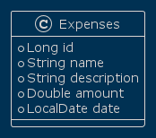

= Expenses-tracker

A simple expenses tracker application using Vert.x.
This application provides CRUD operations for expenses.



Update operation is not implemented yet.

== Building

To launch your tests:
```
./mvnw clean test
```

To package your application:
```
./mvnw clean package
```

To run your application:
```
./mvnw clean compile exec:java
```

*Author*: Kalyankumar R

*License*: Apache License 2.0


